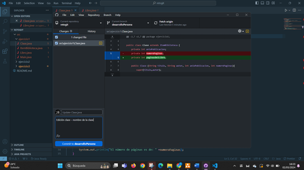

# retogit

## Pasos realizados

### 1. Creación del repositorio

Se crea un repositorio con el nombre **retogit** *(https://github.com/Tanruiga/retogit/tree/main)*

### 2. Subir proyecto Java

Subimos un proyecto Java, en concreto el proyecto relativo al examen del programación:

* src/ejercicio1
* src/ejercicio2
* src/ejercicio3

### 3. Añadimos un nuevo *branch*, pesarrolloPersona

Creamos una nueva *brancg* llamada desarrolloPersona en la que vamos a incluir todos los cambios relativos al reto.

### 4. Sincronizar el repositorio local

Una vez creada la *branch* ahora la sincronizamos con nuestro repositorio local a través de un *fetch* y un *pull*

### 5. Añadimos una nueva clase

Creamos una nueva clase de ejemplo para añadir a la nueva *branch* y poder probar a hacer un *git commit* y un *git push*

### 6. Modificar atributos de la nueva clase

Modificamos atributos de la clase que hemos añadido para ver las diferencias entre el repositorio local y el repositorio remoto

### 7. Ver log de cambios

Una vez realizados los cambios sobre el repositorio analizamos a través de la aplicación web de **GitHub** cual es el historial de cambios

### 8. Fusionar ramas

En esta sección lo que haremos será *mergear* la *branch* **desarrolloPersona** con la *branch* **main** y hacer un *push* para subir los cambios al repositorio remoto
